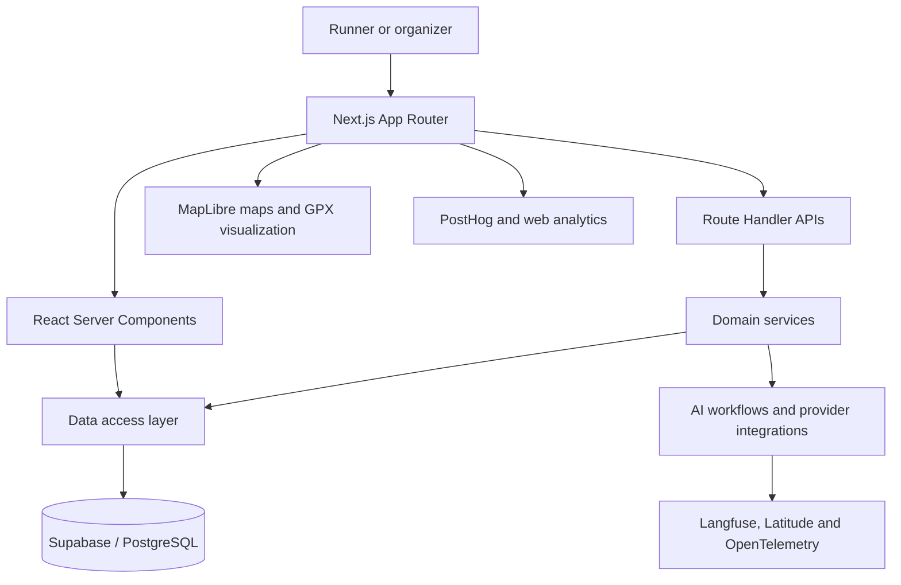

<p align="center">
  
</p>

<h1 align="center">Trail Running Cal</h1>

<p align="center"><strong>An AI-powered platform for discovering and planning trail and mountain races in Spain.</strong></p>

<p align="center">
  <a href="https://www.trailrunningcal.com">Live product</a> ·
  <a href="https://www.trailrunningcal.com/es">Explore races</a> ·
  <a href="#architecture">Technical overview</a>
</p>

Trail Running Cal brings fragmented race information into one maintained, searchable calendar. It helps runners discover events by date, location, distance, race type, and difficulty through a map-and-list experience available in Spanish, Catalan, English, and French.

The product covers trail and mountain races across all of Spain. Road running and worldwide race aggregation are intentionally out of scope.

## Product snapshot

Commercial snapshot, September 2026 (PostHog, excluding internal and test accounts):

| Metric | Value |
| --- | ---: |
| Unique visitors | 20,726 |
| Pageviews | 33,379 |
| Sessions | 24,297 |
| Organic Search traffic | 84.7% |
| Mobile visitors | 71.5% |

Trail Running Cal is actively developed and operated by one product engineer using AI coding agents to increase delivery speed while retaining human ownership of product decisions, architecture, review, testing, and production outcomes.

## The problem

Trail race information is scattered across organizer websites, registration platforms, PDFs, social posts, and regional calendars. The same event may be described differently across sources, while dates, distances, elevation, registration links, and routes can change between editions.

This creates two related problems:

- Runners cannot reliably search and compare the full calendar from one place.
- Maintaining a useful database manually does not scale across hundreds of changing events.

Trail Running Cal addresses both sides: a public discovery product for runners and an AI-assisted curation system for keeping its underlying data structured and current.

## What the product does

### For runners

- Search and filter events by month, province, distance, race type, and difficulty.
- Explore races through synchronized map and list views.
- Compare editions, distances, elevation, dates, and registration information.
- Inspect GPX-powered route maps and elevation profiles when tracks are available.
- Save favorite events and manage a personal profile.
- Browse localized race pages and editorial content.

### For operations

- Discover and research candidate events from unstructured sources.
- Extract race and edition data into validated schemas.
- Detect duplicates and conflicting event identities.
- Review AI output as drafts before publication.
- Import, enrich, translate, update, retry, and resume work in batches.
- Track workflow status and inspect failures through administrative tooling.
- Maintain organizer submissions, race tracks, descriptions, and translations.

## AI-assisted data workflow

AI is used as part of a controlled data pipeline rather than as an unverified publishing layer.


Important workflows use structured outputs, explicit validation, persisted batch state, item-level retries, resumability, and human approval. Model and provider changes can be compared against repeatable evaluation datasets before they reach production.

## Architecture



The application keeps transport, domain logic, and persistence separate:

- Route handlers own authentication, request structure, status codes, and response contracts.
- Services own business rules and multi-step workflows.
- Database modules own reads and writes.
- Multi-table mutations use PostgreSQL functions when atomicity is required.
- Client components access application data through typed API wrappers.
- Server Components read through the server-side data layer.

## Engineering highlights

- **Production-oriented AI operations:** persisted batches, retryable items, resume flows, golden datasets, model evaluations, and trace correlation.
- **Human-in-the-loop publication:** extracted and generated data remains reviewable before it becomes public.
- **Structured race data:** editions, distances, elevation, tiers, locations, organizers, tracks, descriptions, and translations are modeled separately.
- **Geospatial product surface:** MapLibre maps, GPX ingestion, geometry simplification, projection, transport, and elevation profiles.
- **Internationalized discovery:** public UI and race content in `es`, `ca`, `en`, and `fr`; editorial content remains `es` and `ca`.
- **SEO as product infrastructure:** localized routes, structured data, sitemaps, metadata, and index submission support a primarily organic acquisition model.
- **Operational tooling:** internal workflows support research, import, review, publication, updates, translations, and data-quality recovery.
- **Measured product behavior:** PostHog events, batched impressions, Vercel Analytics, Cloudflare Web Analytics, and performance benchmarks.

## Quality, security, and observability

- Unit tests for domain helpers, services, API contracts, maps, analytics, and content behavior.
- Integration tests for critical PostgreSQL workflows and pagination functions.
- Server-side authentication, ownership checks, structural validation, and sanitized inputs.
- Row Level Security and restricted database execution privileges where applicable.
- Rate limiting on exposed operations and generic production error responses.
- AI workflow tracing through Langfuse, Latitude, and OpenTelemetry.
- Redaction of email addresses and API-token-shaped values before trace export.
- Local benchmarks for event-map and homepage performance.

## Core stack

| Area | Technologies |
| --- | --- |
| Application | Next.js 16, React 19, TypeScript |
| UI and content | Tailwind CSS, MDX, next-intl |
| Data and authentication | Supabase, PostgreSQL, Supabase Auth |
| Maps and tracks | MapLibre GL, GeoJSON, GPX/XML processing |
| AI workflows | OpenAI-compatible model integrations, structured outputs, evals |
| Workflow orchestration | Vercel Workflow DevKit |
| Product analytics | PostHog, Vercel Analytics, Cloudflare Web Analytics |
| AI observability | Langfuse, Latitude, OpenTelemetry |
| Verification | Vitest, Testing Library, database integration tests, ESLint, TypeScript |
| Deployment | Vercel |

## Repository guide

```text
app/                    Pages, layouts, Server Components, and API routes
components/             Public product, account, organizer, and admin UI
content/                Editorial MDX content
evals/                  Repeatable AI workflow evaluations and scorers
hooks/                  Reusable client-side state and behavior
lib/api/                Typed client API wrappers
lib/db/                 Database reads, writes, and RPC access
lib/integrations/       External provider clients and adapters
lib/services/           Domain rules and workflow orchestration
lib/security/           Rate limiting and output-safety helpers
locales/                Spanish, Catalan, English, and French translations
scripts/                Imports, migrations, geocoding, benchmarks, and backfills
supabase/migrations/    Versioned PostgreSQL schema and function changes
types/                  Shared domain types
```

## Ownership

Trail Running Cal was conceived, built, and is operated end-to-end by [Ruben Godoy](https://github.com/rubengpr). The work spans product discovery, UX, architecture, data modeling, AI workflow design, implementation, testing, analytics, SEO, operations, and commercial validation.

AI coding agents produce much of the implementation under human direction. Product judgment, requirements, system design, review, verification, and responsibility for production behavior remain human-owned.

## Product direction

The current goal is to deepen nationwide coverage, improve data freshness and strengthen organizer relationships without lowering the curation standard. The long-term ambition is to become Spain's default discovery layer for trail racing.
